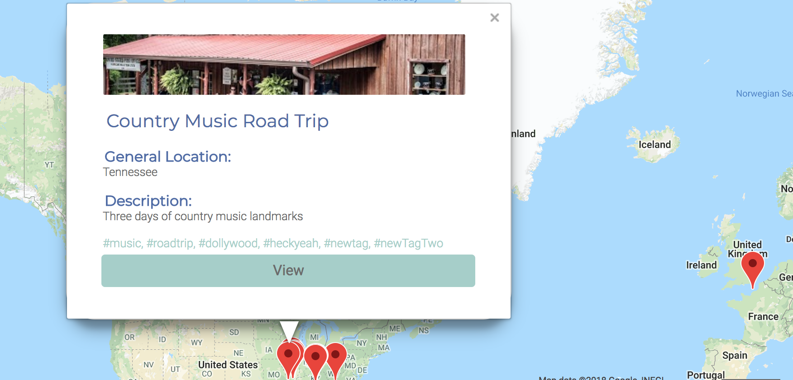
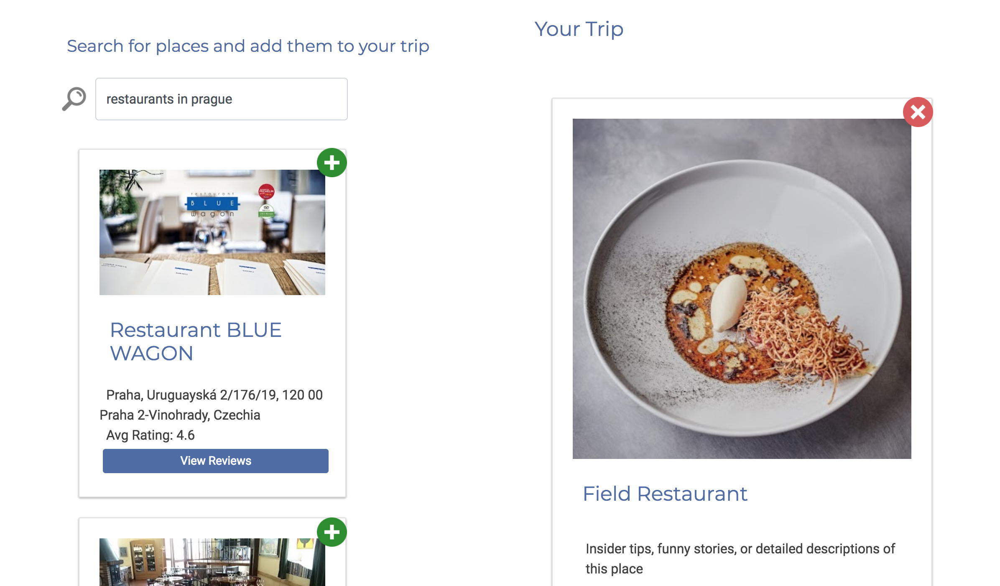
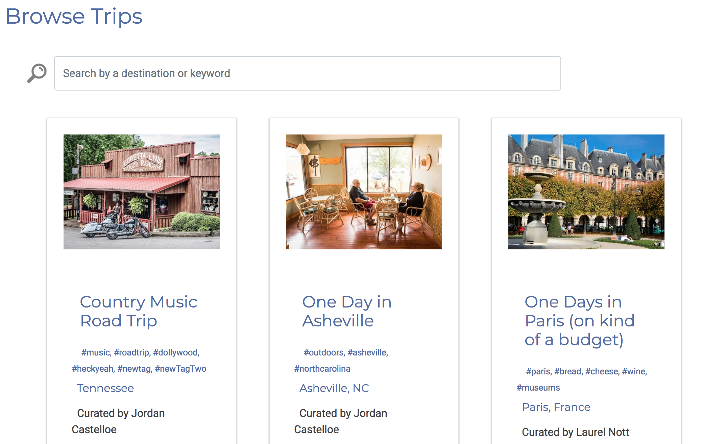
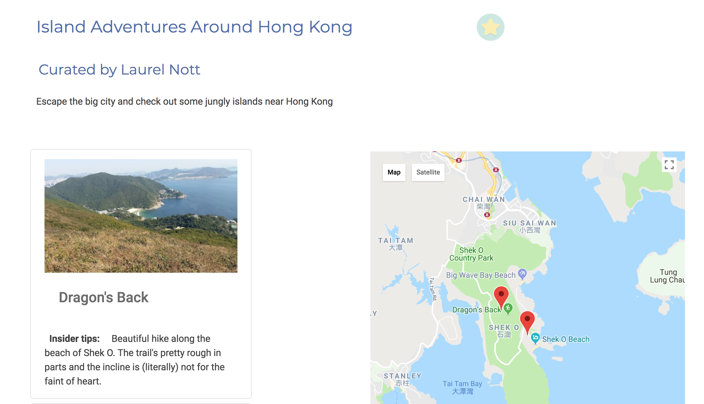

# Travel Buddy
## [Check out the deployed app!](https://nss-capstone-75d59.firebaseapp.com/#!/home)

## This is an app for people who love to travel. 
It was inspired by my dad, who loves to research and plan trips almost more than he loves to take them. He's collected a lifetime's worth of arcane travel knowledge in a series of vertigo-inducing spreadsheets. When he tries to share his wealth of travel ideas with other people, they take one look at the five-thousand line Excel file and have to lay down. I built him an app to plan and share trips in a more accessible format.

## Explore trips all over the world
- All trips will appear on a public map. 
- Click on a marker to view details about each trip

## Build Trips
- Create a trip! Add description and tags so other users can find it.
- Add places to your trip by searching with the Google Places Web Service API
- Reorder places and add your own descriptions and insider tips

## Discvoer Trips
- Browse through trips other users have created
- Search by tags, location, title, or keywords
- Add trips to your favorites

## View Trip Details
- Click on a trip to view all of the locations
- See each location on a map
- See insider tips for each location

## Instructions

Run on your local server:
- `` git clone ``
- `` cd travel-buddy``
- `` npm install``
- `` grunt ``
- Start your server in the `travel-buddy` folder.

## Technology
- Angular JS
- Google Maps JavaScript API
- Google Places Web Service API
- Firebase 

## Relevant Links
- [Firebase Database](https://console.firebase.google.com/project/nss-capstone-75d59/database)
- [Trello](https://trello.com/b/Tzkh8R6N/capstone)
- [Ng-Map Directive Documentation](https://ngmap.github.io/)
- [Ng-Tags-Input Directive Documentation](http://mbenford.github.io/ngTagsInput/)

